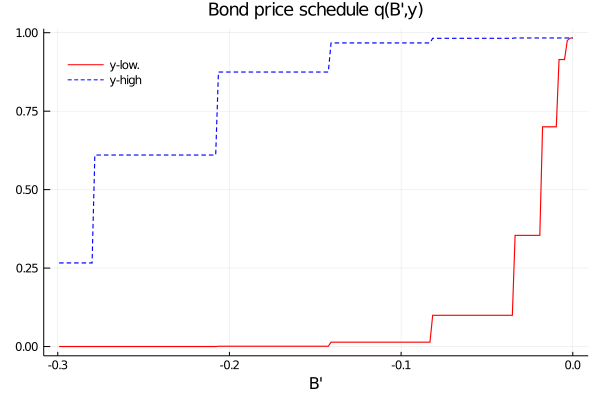
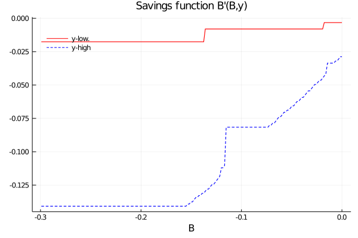
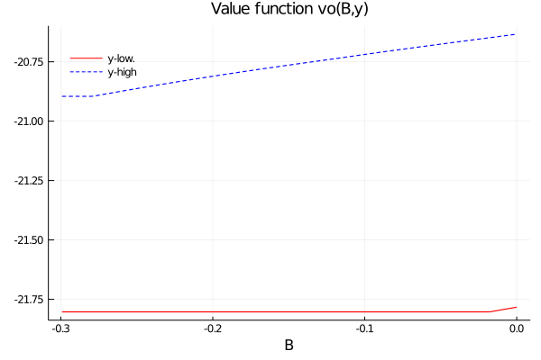
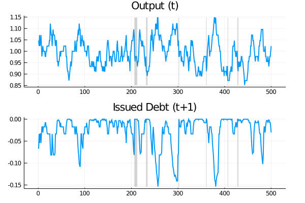
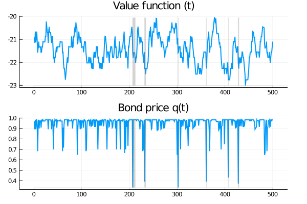
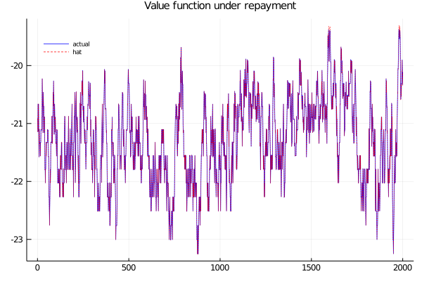
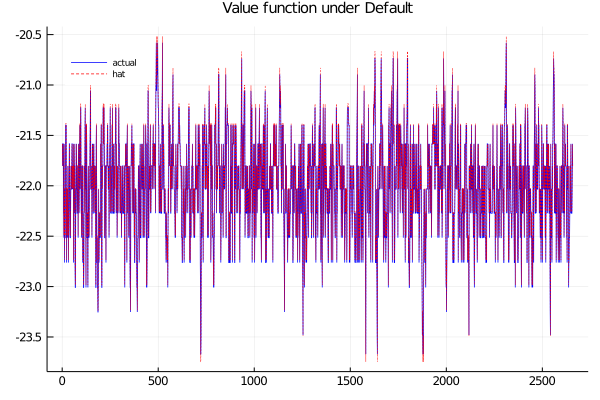
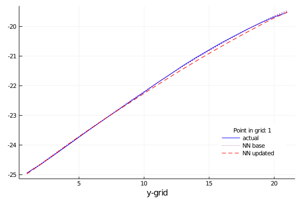
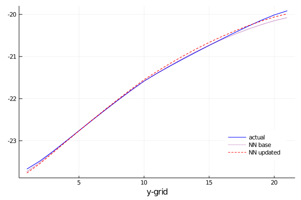

# Notes
The following are notes related with the state of the code for solving
modelos de default with neural networks.

## Defining the algorithm to solve the economy
The **pseudo** code is
```julia
function Solver(params, deffun, utifun)
    # --------------------------------------------------------------
    # 1. Tauchen discretization of log-output
    ly, P = mytauch(μ, ρ, η, nx, m)
    y = exp.(ly)
    # --------------------------------------------------------------
    # 2. Output in case of default
    ydef =h(y)
    udef =u(ydef)
    # --------------------------------------------------------------
    p0 := position of the 0-level debt
    # --------------------------------------------------------------
    # 4. Solving the fixed point problem
    vf, vr, vd, D, bp, q = FixedPoint(b, y, udef, P, p0, params, utifun)
end

function FixedPoint(b, y, udef, P, p0, params, utf)
    # ----------------------------------------
    # calculate y + B
    yb = b .+ y'
    # ----------------------------------------
    # 2. Educated Guess :
    #    vr: value of repayment
    #    vd: value of default
    #    vf: value function
    vr   = 1 / (1 - β) * utf.((r / (1 + r)) * b .+ y', σrisk)
    udef = repeat(udef', ne, 1)
    vd   = 1 / (1 - β) * udef
    vf   = max.(vr, vd)
    D     = 1 * (vd .> vr)
    # ----------------------------------------
    # 3. Fixed Point Problem
    while dif > tol && rep < maxite
        vf, vr, vd, D, bp, q, dif = value_functions!(...)
        rep += 1
    end
end

function value_functions!( vf, vr, vd, D, bp, dif, b, P, p0, yb, udef,
            β, θ, utf, r, σrisk)
    # ----------------------------------------
    # 1. Saving old information (ne = # endogeneous grid, nx states for y)
    vf_old = vf;
    ne,nx = size(vf)
    # ----------------------------------------
    # 2. Expected future Value Function
    βevf = β * (vf * P')    # today' value of expected value function
    eδD  = D  * P'          # probability of default in the next period
    evd  = vd * P'          #  expected value of default
    qold = (1 / (1 + r)) * (1 .- eδD) # price
    qb   = qold .* b        # Initial price for each point in the grid
    # --------------------------------------------------------------
    # 3. Value function of continuation
    vr, bp :=
            for i = 1:ne
                cc = yb[i, :]' .- qb
                cc[cc.<0] .= 0
                aux_u = utf.(cc, σrisk) + βevf
                vr[i, :], bp[i, :] = findmax(aux_u, dims = 1)
            end
    # --------------------------------------------------------------
    # 4. Value function of default
    βθevf = θ * βevf[p0, :]   # expected vf with b=0, in present val
    vd    = βθevf' .+ (udef + β * (1 - θ) * evd)
    # --------------------------------------------------------------
    # 5. Continuation Value and Default choice
    vf, D = (max.(vr, vd), 1 * (vd .> vr))
    q = (1 / (1 + r)) * (1 .- (D * P'))
    # --------------------------------------------------------------
    # 6.  Divergence respect the initial point
    dif = maximum(abs.(vf - vf_old))
end

```
This code takes 6.5 seconds in running with 278 iterations until achieve a convergence level of 1e-8. Its results are:

<table style= "width:100%">
<tr>
<th style="text-align: center"> Bond price </th>
<th style="text-align: center"> Bond issuing policy function</th>
<th style="text-align: center"> Value function</th>
</tr>
<tr>
<th>


</th>
<th>


</th>
<th>


</th>
</tr>
</table>

## Simulation
Then I simulate the economy follow the next:
```julia
function ModelSim(params, PolFun, ext; nsim = 100000, burn = 0.05)
    nsim2 = Int(floor(nsim * (1 + burn)))
    # ----------------------------------------------------------------------
    # 1. State simulation
    choices = 1:nx    # Possible states
    simul_state = zeros(Int64, nsim2);
    simul_state[1]  = rand(1:nx);
    for i = 2:nsim2
        simul_state[i] = sample(view(choices, :, :), Weights(view(P, simul_state[i-1], :)))
    end
    # -------------------------------------------------------------------------
    # 2. Simulation of the Economy
    orderName = "[Dₜ₋₁,Bₜ, yₜ, Bₜ₊₁, Dₜ, Vₜ, qₜ(bₜ₊₁(bₜ,yₜ)) yⱼ"
    distϕ     = Bernoulli(θ)
    EconSim[1, 1:2] = [0 b[rand(1:ne)]]  # b could be any value in the grid
    EconSim = simulation!(...)
    # -------------------------------------------------------------------------
    # 3. Burning and storaging
    EconSim = EconSim[end-nsim:end-1, :]
end
function simulation!(sim, simul_state, PolFun, y, ydef, b,distϕ, nsim2, p0)
    for i = 1:nsim2-1
        bi = findfirst(x -> x == sim[i, 2], b) # position of B
        j = simul_state[i]                     # state for y
        # Choice if there is not previous default
        if sim[i, 1] == 0
            defchoice = D[bi, j]
            ysim = (1 - defchoice) * y[j] + defchoice * ydef[j]
            bsim = (1 - defchoice) * bp[bi, j]
            sim[i, 3:8] = [ysim bsim defchoice vf[bi, j] q[bi, j] y[j]]
            sim[i+1, 1:2] = [defchoice bsim]
        else
        # Under previous default
            defstat = rand(distϕ)
            if defstat == 1 # They are in the market
                sim[i, 1] == 0
                defchoice = D[p0, j] # default again?
                ysim = (1 - defchoice) * y[j] + defchoice * ydef[j]# output | choice
                bsim = (1 - defchoice) * bp[p0, j]
                sim[i, 3:8] =
                    [ysim bsim defchoice vf[p0, j] q[p0,j] y[j]]
                sim[i+1, 1:2] = [defchoice bsim]
            else # They are out the market
                sim[i, 3:8] =
                    [ydef[j] 0 1 vd[p0, j] q[p0, j] y[j]] #second change
                sim[i+1, 1:2] = [1 0]
            end
        end
    end
end
```

This simulation gives different result each time (we are not defining a seed) and also it starts in any position of the grid, with the economy in the market. This code gives the following results

<table style= "width:100%">
<tr>
<th>


</th>
<th>


</th>
<th>


</th>
</tr>
</table>
with ~2.5 probabilities of picking a default event.

## Training of neural networks


<table>
<tr>
<th style="text-align: center"> Value of Repayment </th>
<th style="text-align: center"> Value of Default</th>
</tr>
<tr>
<th>


</th>
<th>


</th>
</tr>
</table>


<table>
<tr>
<th style="text-align: center"> Value of Repayment </th>
<th style="text-align: center"> Value of Default</th>
</tr>
<tr>
<th>


</th>
<th>


</th>
</tr>
</table>
