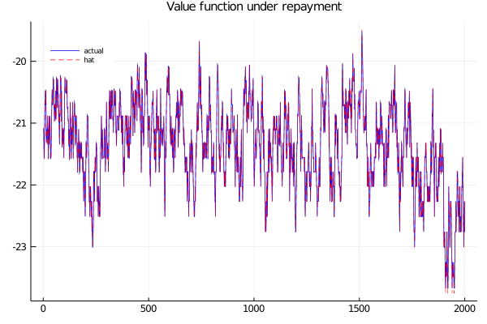
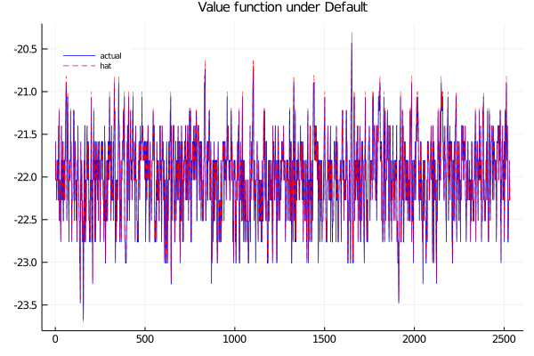
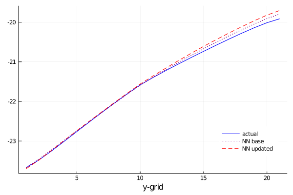

# Notes
The following are notes related with the state of the code

<table>
<tr>
<th style="text-align: center"> Value of Repayment </th>
<th style="text-align: center"> Value of Default</th>
</tr>
<tr>
<th>

</th>
<th>

</th>
</tr>
</table>

<table>
<tr>
<th style="text-align: center"> Value of Repayment </th>
<th style="text-align: center"> Value of Default</th>
</tr>
<tr>
<th>

</th>
<th>

</th>
</tr>
</table>
