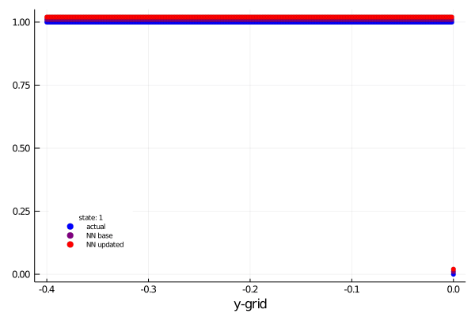
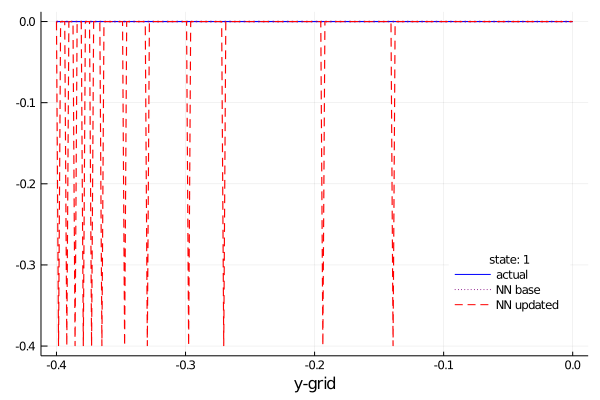
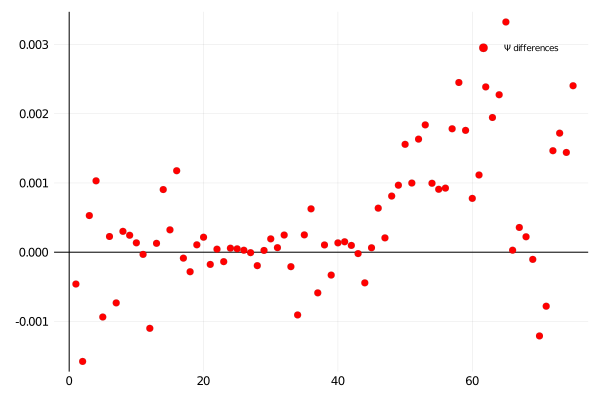
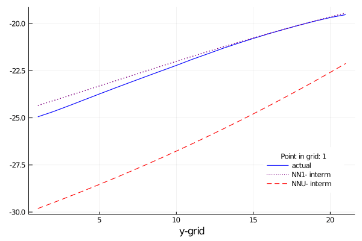
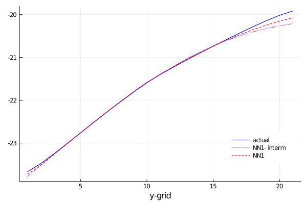
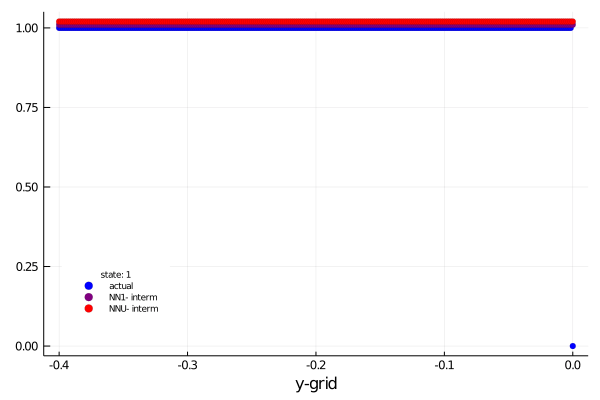
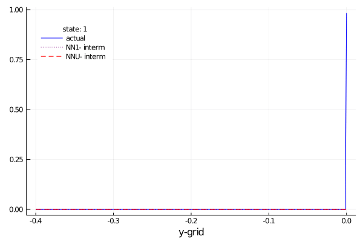

# Notes
The following are notes related with the state of the code for solving
modelos de default with neural networks.

## Defining the algorithm to solve the economy
The **pseudo** code is
```julia
function Solver(params, deffun, utifun)
    # --------------------------------------------------------------
    # 1. Tauchen discretization of log-output
    ly, P = mytauch(μ, ρ, η, nx, m)
    y = exp.(ly)
    # --------------------------------------------------------------
    # 2. Output in case of default
    ydef =h(y)
    udef =u(ydef)
    # --------------------------------------------------------------
    p0 := position of the 0-level debt
    # --------------------------------------------------------------
    # 4. Solving the fixed point problem
    vf, vr, vd, D, bp, q = FixedPoint(b, y, udef, P, p0, params, utifun)
end

function FixedPoint(b, y, udef, P, p0, params, utf)
    # ----------------------------------------
    # calculate y + B
    yb = b .+ y'
    # ----------------------------------------
    # 2. Educated Guess :
    #    vr: value of repayment
    #    vd: value of default
    #    vf: value function
    vr   = 1 / (1 - β) * utf.((r / (1 + r)) * b .+ y', σrisk)
    udef = repeat(udef', ne, 1)
    vd   = 1 / (1 - β) * udef
    vf   = max.(vr, vd)
    D     = 1 * (vd .> vr)
    # ----------------------------------------
    # 3. Fixed Point Problem
    while dif > tol && rep < maxite
        vf, vr, vd, D, bp, q, dif = value_functions!(...)
        rep += 1
    end
end

function value_functions!( vf, vr, vd, D, bp, dif, b, P, p0, yb, udef,
            β, θ, utf, r, σrisk)
    # ----------------------------------------
    # 1. Saving old information (ne = # endogeneous grid, nx states for y)
    vf_old = vf;
    ne,nx = size(vf)
    # ----------------------------------------
    # 2. Expected future Value Function
    βevf = β * (vf * P')    # today' value of expected value function
    eδD  = D  * P'          # probability of default in the next period
    evd  = vd * P'          #  expected value of default
    qold = (1 / (1 + r)) * (1 .- eδD) # price
    qb   = qold .* b        # Initial price for each point in the grid
    # --------------------------------------------------------------
    # 3. Value function of continuation
    vr, bp :=
            for i = 1:ne
                cc = yb[i, :]' .- qb
                cc[cc.<0] .= 0
                aux_u = utf.(cc, σrisk) + βevf
                vr[i, :], bp[i, :] = findmax(aux_u, dims = 1)
            end
    # --------------------------------------------------------------
    # 4. Value function of default
    βθevf = θ * βevf[p0, :]   # expected vf with b=0, in present val
    vd    = βθevf' .+ (udef + β * (1 - θ) * evd)
    # --------------------------------------------------------------
    # 5. Continuation Value and Default choice
    vf, D = (max.(vr, vd), 1 * (vd .> vr))
    q = (1 / (1 + r)) * (1 .- (D * P'))
    # --------------------------------------------------------------
    # 6.  Divergence respect the initial point
    dif = maximum(abs.(vf - vf_old))
end

```
This code takes 6.5 seconds in running with 278 iterations until achieve a convergence level of 1e-8. Its results are:

<table style= "width:100%">
<tr>
<th style="text-align: center"> Bond price </th>
<th style="text-align: center"> Bond issuing policy function</th>
<th style="text-align: center"> Value function</th>
</tr>
<tr>
<th>


</th>
<th>


</th>
<th>


</th>
</tr>
</table>

## Simulation
Then I simulate the economy follow the next:
```julia
function ModelSim(params, PolFun, ext; nsim = 100000, burn = 0.05)
    nsim2 = Int(floor(nsim * (1 + burn)))
    # ----------------------------------------------------------------------
    # 1. State simulation
    choices = 1:nx    # Possible states
    simul_state = zeros(Int64, nsim2);
    simul_state[1]  = rand(1:nx);
    for i = 2:nsim2
        simul_state[i] = sample(view(choices, :, :), Weights(view(P, simul_state[i-1], :)))
    end
    # -------------------------------------------------------------------------
    # 2. Simulation of the Economy
    orderName = "[Dₜ₋₁,Bₜ, yₜ, Bₜ₊₁, Dₜ, Vₜ, qₜ(bₜ₊₁(bₜ,yₜ)) yⱼ"
    distϕ     = Bernoulli(θ)
    EconSim[1, 1:2] = [0 b[rand(1:ne)]]  # b could be any value in the grid
    EconSim = simulation!(...)
    # -------------------------------------------------------------------------
    # 3. Burning and storaging
    EconSim = EconSim[end-nsim:end-1, :]
end
function simulation!(sim, simul_state, PolFun, y, ydef, b,distϕ, nsim2, p0)
    for i = 1:nsim2-1
        bi = findfirst(x -> x == sim[i, 2], b) # position of B
        j = simul_state[i]                     # state for y
        # Choice if there is not previous default
        if sim[i, 1] == 0
            defchoice = D[bi, j]
            ysim = (1 - defchoice) * y[j] + defchoice * ydef[j]
            bsim = (1 - defchoice) * bp[bi, j]
            sim[i, 3:8] = [ysim bsim defchoice vf[bi, j] q[bi, j] y[j]]
            sim[i+1, 1:2] = [defchoice bsim]
        else
        # Under previous default
            defstat = rand(distϕ)
            if defstat == 1 # They are in the market
                sim[i, 1] == 0
                defchoice = D[p0, j] # default again?
                ysim = (1 - defchoice) * y[j] + defchoice * ydef[j]# output | choice
                bsim = (1 - defchoice) * bp[p0, j]
                sim[i, 3:8] =
                    [ysim bsim defchoice vf[p0, j] q[p0,j] y[j]]
                sim[i+1, 1:2] = [defchoice bsim]
            else # They are out the market
                sim[i, 3:8] =
                    [ydef[j] 0 1 vd[p0, j] q[p0, j] y[j]] #second change
                sim[i+1, 1:2] = [1 0]
            end
        end
    end
end
```

This simulation gives different result each time (we are not defining a seed) and also it starts in any position of the grid, with the economy in the market. This code gives the following results

<table style= "width:100%">
<tr>
<th>


</th>
<th>


</th>
<th>


</th>
</tr>
</table>
with ~2.5 probabilities of picking a default event.

## Training of neural networks
I estimate two neural networks, using a mean square error as loss function, a softplus activation function, and a descent optimizer. The model for the value function of repayment includes 16 neurons and 2 states ``vr = vr(b, y)`` while the neural network for default considers just 3 neurons and 1 state ``vd = vd(y)``. I normalize the value functions and states before splitted them into the two groups (_see_ _``simtoneu``_ _code_). The normalization is the type:

```math
̃x =  (x - 0.5(xmax + xmin))/ (0.5(xmax- xmin))
```
The psedo code for a julia implementation is:
```julia
neudata = simtoneu(econsim,normi);
NetWorkR, NetWorkD = training(neudata);

```
```julia
simtoneu(econsim,normi) = begin
   dst = econsim.sim[:, 5]
   # value function
   vf  = econsim.sim[:, 6]
   vf, vmax, vmin = normi(vf) # normalization
   vr  = vf[dst.==0]
   vd  = vf[dst.==1]
   # states
   st = econsim.sim[:, [2,8]]
   s, smax, smin = normi(st)
   sr = s[dst.==0, :]
   sd = s[dst.==1, :][:,2];
end
training(data; nepoch = 10) = begin
   ϕf(x) = log1p(exp(x));
   #+++++++++++++++++++++++++++++++++
   #  Neural Network for No default
   NetWorkR = Chain(Dense(ns1, Q1, ϕf), Dense(Q1, 1))
   lr(x, y) = Flux.mse(NetWorkR(x), y)
   datar = Flux.Data.DataLoader(sr', vr')
   psr   = Flux.params(NetWorkR)
   Flux.@epochs nepoch begin
      Flux.Optimise.train!(lr, psr, datar, Descent())
      display(lr(sr', vr'))
   end
   #+++++++++++++++++++++++++++++++++
   #  Neural Network for Default
   NetWorkD = Chain(Dense(ns2, Q2, ϕf), Dense(Q2, 1))
   ld(x, y) = Flux.mse(NetWorkD(x), y)
   datad = Flux.Data.DataLoader(sd', vd')
   psd = Flux.params(NetWorkD)
   Flux.@epochs nepoch begin
      Flux.Optimise.train!(ld, psd, datad, Descent())
      display(ld(sd', vd'))
   end
end
```
The fit obtained with these models is showed in the graphics
<table>
<tr>
<th style="text-align: center"> Value of Repayment </th>
<th style="text-align: center"> Value of Default</th>
</tr>
<tr>
<th>


</th>
<th>


</th>
</tr>
</table>

## Solving given neural networks
From the training block we have two set of parameters ``Θᴿ, Θᴰ`` that I will use to predict the set of value of repayment and value of default in the grid, then chooing the optimal debt level. The pseudo code is:
```julia
pm := Set of parameters;
polfunN, polintN = neutopol(...);
econsimN = DefEcon.ModelSim(...)
```
```julia
neutopol(NetWorkR, NetWorkD, pm, neudata) = begin
   # pm is a ntuple with parameters
   #+++++++++++++++++++++++++++++++++
   # State normalization

   smax, smin   := Comming from simtoneu
   vrmax, vrmin := Comming from simtoneu
   vdmax, vdmin := Comming from simtoneu
   # under the normalization process vrmax = vdmax , vrmin = vdmin

   states = [repeat(bgrid, nx, 1) repeat(ygrid, inner = (ne, 1))]
   stater = (states .- 0.5 * (smax + smin)) ./ (0.5 * (smax - smin))
   stated = stater[:, 2]
   #+++++++++++++++++++++++++++++++++
   # Expected Values
   # [Value under no default]
   vr = NetWorkR(stater')
   vr = (0.5 * (vrmax - vrmin) * vr) .+ 0.5 * (vrmax + vrmin)
   vr = reshape(vr, pm.ne, pm.nx)

   # [Value under default]
   vd = NetWorkD(stated')
   vd = (0.5 * (vdmax - vdmin) * vd) .+ 0.5 * (vdmax + vdmin)
   vd = reshape(vd, pm.ne, pm.nx)

   # [Value function]
   vf = max.(vr,vd)
   D = 1 * (vd .> vr)

   # [Expected Values]
   evf = vf *pm.P'; # expected value function
   evd = vd * pm.P' # expected value of being in default in the next period
   #+++++++++++++++++++++++++++++++++
   # Expected price
   q = (1 / (1 + pm.r)) * (1 .- (D * pm.P'))
   qB = q .* pm.bgrid
   #+++++++++++++++++++++++++++++++++
   # UPDATING!
   # Maximization
   βevf = pm.β * evf
   for i = 1:pm.ne
      cc = pm.yb[i, :]' .- qB;
      cc[cc.<0] .= 0;
      aux_u = pm.utf.(cc, pm.σrisk) + βevf;
      vrnew[i, :], bindex[i, :] = findmax(aux_u, dims = 1)
   end
   #+++++++++++++++++++++++++++++++++
   # Value of default
   βθevf = pm.β * pm.θ * evf[pm.p0, :]
   vdnew = βθevf' .+ (pm.udef' .+ pm.β * (1 - pm.θ) * evd)
   #+++++++++++++++++++++++++++++++++
   # Optimal choice
   vfnew = max.(vrnew, vdnew)
   Dnew = 1 * (vdnew .> vrnew)
   qnew = (1 / (1 + pm.r)) * (1 .- (Dnew * pm.P'))
   bpnew = pm.BB[bindex]
   polfunnew := Updated version of the PolFun after maximization
   polfunint := ValueFunction that comes from the prediction of NN
   return polfunnew, polfunint;
end
```
after running this implementation we obtain (right panel is a .gif) the following results. The solid blue line is the actual value of the value of repayment/debt for an specific level of debt and through the y-grid (x-axis), the dot line are the value functions obtained after using the result of the initial neural network and after applying the function ``neutopol``, while the dashed red line.
<table>
<tr>
<th style="text-align: center"> Value of Repayment </th>
<th style="text-align: center"> Value of Default</th>
</tr>
<tr>
<th>


</th>
<th>


</th>
</tr>
</table>
On the other hand, the policies function in these cases are:

#### DEFAULT POLICY FUNCTION



#### BOND PRICE POLICY FUNCTION


#### ISSUING OF DEBT POLICY FUNCTION



The updating function is:
```julia
updateneu!(NetWork1,NetWork2,data) = begin
   #+++++++++++++++++++++++++++++++++
   set1old = Flux.destructure(NetWork1); # Structure 1
   set2old = Flux.destructure(NetWork2); # Structure 2
   #+++++++++++++++++++++++++++++++++
   @unpack rdata, ddata, limt = data;
   vr1, sr1 := data from the NN base
   vd1, sd1 := data from the NN base
   #+++++++++++++++++++++++++++++++++
   # Updating of Repayment NN
   lr(x, y) = Flux.mse(NetWork1(x), y)
   datar    = (sr1', vr1');
   psr      = Flux.params(NetWork1)
   gsr = gradient(psr) do
      lr(datar...)
   end
   Flux.Optimise.update!(Descent(), psr, gsr) # Updating 1

   # Updating of Default NN
   ld(x, y) = Flux.mse(NetWork2(x), y)
   datad    = (sd1', vd1');
   psd      = Flux.params(NetWork2)
   gsd = gradient(psd) do
      ld(datad...)
   end
   Flux.Optimise.update!(Descent(), psd, gsd)   # Updating 2
end
```
this function gives us the following differencial in parameters



Addtionally the intermediate steps in the solution based on neural networks are
<table>
<tr>
<th style="text-align: center"> Value of Repayment </th>
<th style="text-align: center"> Value of Default</th>
</tr>
<tr>
<th>


</th>
<th>


</th>
</tr>
</table>
#### DEFAULT POLICY FUNCTION



#### BOND PRICE POLICY FUNCTION


